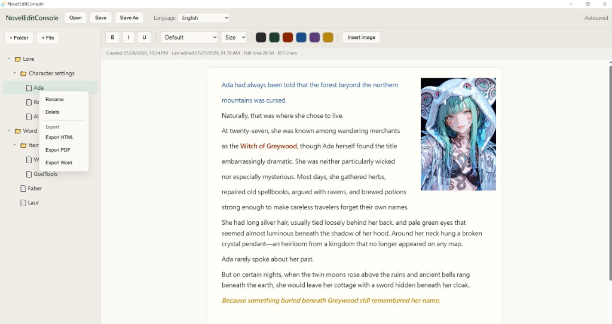

# NovelEditConsoleT

A focused novel writing app built with **Tauri 2 + React + TipTap**.  
以寫作為核心的桌面小說編輯器。



---

## 中文

### 簡介

NovelEditConsoleT 是一款簡單、專注的小說編輯軟體：介面清楚、功能精簡，讓你把注意力放在故事本身。

### 功能特色

- **雙欄編輯介面**  
  左側章節樹、右側編輯區，結構清楚，沒有多餘干擾。

- **多層章節樹**  
  可建立資料夾與章節檔，並以拖曳調整層級與順序，方便管理世界觀資料與故事章節。

- **富文字編輯**  
  右側提供常見文字格式工具，寫作流暢直覺。

- **浮動圖片**  
  支援插入圖片，可自由拖曳位置與縮放，所見即所得。

- **即時自動儲存**  
  結構與內容變更會自動保存；重開即可接續上次專案與章節，隨開即寫、隨關即存。

- **彈性匯出**  
  可匯出單一章節，也可連同節點下多個章節一次匯出。支援 **PDF / Word / HTML**。

- **多國語系**  
  介面支援多種語言切換。

### 使用方式

雙擊以下任一方式即可啟動：

- `start.bat`
- `NovelEditConsole.exe`（若你已打包）

首次啟動若無可讀專案，會進入空白工作區；一開始編輯後，檔案預設會存到程式目錄下的 `autosave/`。

### 專案格式（v3）

```text
my-novel.novelproj.json              # 目錄結構
my-novel.novelproj.content/          # 各章 TipTap JSON
my-novel.novelproj.assets/images/    # 圖片資產
my-novel.novelproj.chapter-stats.json
```

### 開發（進階）

```bash
cd "E:\AI TEST\NovelEditConsoleT"
npm install
npm run tauri dev
```

### 打包 exe

```bash
npm run tauri build
```

產物位於 `src-tauri/target/release/`。

### 環境需求

- Node.js 18+
- Rust（[rustup](https://rustup.rs/)）
- Windows：WebView2（Windows 10 / 11 通常已內建）

---

## English

### Overview

NovelEditConsoleT is a simple, writing-first desktop novel editor. The UI stays clear and lean so you can focus on the story—not the tool.

### Features

- **Two-pane workspace**  
  Chapter tree on the left, editor on the right—clean layout without clutter.

- **Multi-level chapter tree**  
  Create folders and chapter files, then drag to reorder or reparent. Great for both story chapters and worldbuilding notes.

- **Rich-text editing**  
  Familiar formatting tools for a smooth writing flow.

- **Floating images**  
  Insert images, then drag and resize them freely (WYSIWYG).

- **Autosave**  
  Structure and content changes save automatically. Reopening restores your last project and chapter—open, write, close.

- **Flexible export**  
  Export a single chapter or an entire subtree. Formats: **PDF / Word / HTML**.

- **Multi-language UI**  
  Switch interface languages as needed.

### How to run

Launch with either:

- `start.bat`
- `NovelEditConsole.exe` (if you have a built binary)

If no readable project is found on first launch, you get a blank workspace. Once you start editing, files default to the app’s `autosave/` folder.

### Project format (v3)

```text
my-novel.novelproj.json              # tree / structure
my-novel.novelproj.content/          # TipTap JSON per chapter
my-novel.novelproj.assets/images/    # image assets
my-novel.novelproj.chapter-stats.json
```

### Development (advanced)

```bash
cd "E:\AI TEST\NovelEditConsoleT"
npm install
npm run tauri dev
```

### Build executable

```bash
npm run tauri build
```

Output is under `src-tauri/target/release/`.

### Requirements

- Node.js 18+
- Rust ([rustup](https://rustup.rs/))
- Windows: WebView2 (usually preinstalled on Windows 10 / 11)
